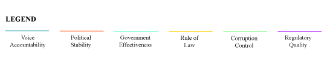

```{r setup, include=FALSE}
knitr::opts_chunk$set(echo = TRUE)
```

## Introduction

In the summer of 2012, more than 100 maurauders on horseback crossed from Chad into Cameroon's Bouba Ndjidah National park with one mission: to kill as many elephants as possible without getting caught. Using rocket-propelled grenades and AK-47s, they mowed down hundreds of elephants, decimating entire herds, all for one reason: ivory.  

The illegal killing of elephants in Africa for their ivory takes places sometimes on a small scale, with poisoned watermelons, and other times on a large scale, using belt-fed automatic weapons. But regardless of the method, when an elephant comes into contact with a poacher, more often than not, the poacher gets what he came for. This is why between 2010 and 2012 alone, some 100,000 elephants were slaughtered. There only "crime" that they hold the ivory that the world cannot seem to resist.  

This project seeks to understand the socio-economic factors that may contribute to poaching. Several researchers have studied the problem, and their findings will be taken into account in the model. For instance, _______ studied the effect of regulated and unregulated markets and showed that the presence of unregulated markets, either in-country or in a bordering country, had a significant impact on poaching activity.

```{r message=FALSE}
library(ggplot2)
library(ggthemes)
library(psych)
library(GGally)
library(grDevices)
library(colorRamps)
library(dplyr)
library(maptools)
library(RColorBrewer)
library(blme)
library(lubridate)
library(reporttools)
library(stargazer)
library(fpp)
library(xtable)
library(plotly)
library(Cairo)
library(MASS)
library(car)
library(Amelia)
library(corrplot)
library(caret)
options(xtable.floating = FALSE)
options(xtable.timestamp = "")
```  

## Data preprocessing and exploratory analysis

```{r cache=TRUE}

# READ IN DATASET
elephants <- read.csv("elephant_master.csv", header = TRUE)
```
```{r}
sapply(elephants, function(x) sum(is.na(x)))
```  
There are significant numbers of missing values in the dataset, so imputation will be necessary. 

Note that the mean number of elephant carcasses for a given year is `r mean(elephants$Tot.Carcasses, na.rm=TRUE)` and the mean number of illegal carcasses is `r mean(elephants$Illegal.Carcasses, na.rm=TRUE)`, indicating that approximately half of all elephant deaths recorded are due to illegal poaching.
  
### Governance indicators by region 
  
```{r warning=FALSE, fig.align='center' }
elephantsFC <- filter(elephants, subregionid=="FC")
elephantsFW <- filter(elephants, subregionid=="FW")
elephantsFE <- filter(elephants, subregionid=="FE")
elephantsFS <- filter(elephants, subregionid=="FS")

governanceFC <- ggplot(data=elephantsFC, aes(x=year))+
  geom_line(aes(y=Voice.Accountability), color="cadetblue3")+
  geom_line(aes(y=Political.Stability), color="coral")+
  geom_line(aes(y=Government.Effectiveness), color="aquamarine")+
  geom_line(aes(y=Rule.Law), color="gold")+  
  geom_line(aes(y=Corruption.Control), color="palegreen")+
  geom_line(aes(y=Reg.Quality), color="darkorchid1")+
  ylim(-2, 3) + xlab(NULL) + ylab(NULL) +
  ggtitle("Governance Indicators for Central Africa") + theme_bw()
governanceFC + facet_wrap(~country, ncol = 4)
```
  
```{r warning=FALSE, fig.align='center'}
governanceFW <- ggplot(data=elephantsFW, aes(x=year))+
  geom_line(aes(y=Voice.Accountability), color="cadetblue3")+
  geom_line(aes(y=Political.Stability), color="coral")+
  geom_line(aes(y=Government.Effectiveness), color="aquamarine")+
  geom_line(aes(y=Rule.Law), color="gold")+
  geom_line(aes(y=Corruption.Control), color="palegreen")+
  geom_line(aes(y=Reg.Quality), color="darkorchid1")+
  ylim(-2, 3) + xlab(NULL) + ylab(NULL) +
  ggtitle("Governance Indicators for Western Africa")+ theme_bw()
governanceFW + facet_wrap(~country, ncol = 4)
```
  
```{r warning=FALSE, fig.align='center'}
governanceFE <- ggplot(data=elephantsFE, aes(x=year))+
  geom_line(aes(y=Voice.Accountability), color="cadetblue3")+
  geom_line(aes(y=Political.Stability), color="coral")+
  geom_line(aes(y=Government.Effectiveness), color="aquamarine")+
  geom_line(aes(y=Rule.Law), color="gold")+
  geom_line(aes(y=Corruption.Control), color="palegreen")+
  geom_line(aes(y=Reg.Quality), color="darkorchid1")+
  ylim(-2, 3) + xlab(NULL) + ylab(NULL) +
  ggtitle("Governance Indicators for Eastern Africa")+ theme_bw()
governanceFE + facet_wrap(~country, ncol = 4)
```

```{r warning=FALSE, fig.align='center'}
governanceFS <- ggplot(data=elephantsFS, aes(x=year))+
  geom_line(aes(y=Voice.Accountability), color="cadetblue3")+
  geom_line(aes(y=Political.Stability), color="coral")+
  geom_line(aes(y=Government.Effectiveness), color="aquamarine")+
  geom_line(aes(y=Rule.Law), color="gold")+
  geom_line(aes(y=Corruption.Control), color="palegreen")+
  geom_line(aes(y=Reg.Quality), color="darkorchid1")+
  ylim(-2, 3) + xlab(NULL) + ylab(NULL) +
  ggtitle("Governance Indicators for Southern Africa")+ theme_bw()
governanceFS + facet_wrap(~country, ncol = 4)
```  
  
  
From these visualizations we can see that governance indicators show a great deal of volatility, especially with respect to the countries of central Africa.

```{r fig.align="center"}
# NORMALIZE AND STANDARDIZE THE DATA
centered.elephants <- data.frame(scale(elephants[,c(9:31,36:41,45:49)]))
centered.elephants <- cbind(elephants[,c(1:8, 32:35,42:44)], centered.elephants)
summary(centered.elephants)
```  
  
Several of the variables still appear to be highly skewed, so further transformation will be required, as the `Amelia II` package imputes missing values assuming a normal distribution.  

```{r}
# EXAMINE DATA FOR HIGHLY CORRELATED VARIABLES
clrs <- brewer.pal(10, "Spectral")
cors <- cor(centered.elephants[,9:49], use = "pairwise")
corrplot <- corrplot.mixed(cors, col = clrs, number.cex=0.3,
                     tl.pos="lt", tl.cex=0.5, tl.col="black",
                     tl.srt=45)

# REMOVE HIGHLY CORRELATED VARIABLES
pd.elephants <- subset(centered.elephants, 
                       subset=TRUE, select=c(1:10,12:23,26:40,42:49))

# CREATE DUMMY VARIABLE TO USE FOR BINOMIAL RESPONSE
pd.elephants$Percent.Illegal <- pd.elephants$Illegal.Carcasses /
                                  pd.elephants$Tot.Carcasses

pd.elephants$High.Illegal <- factor(with(pd.elephants, 
                                         ifelse((Percent.Illegal > 0.5), 1, 0)))

table(pd.elephants$High.Illegal)

```  
Linear regression was run on each of the highly correlated variables to determine which variables should be removed. Four variables were deleted from the dataset. We also see that of the observed values of total elephant carasses in relation to illegal carcasses, 252 observations meet the condition of more than 50% of the total were killed illegally.
  
```{r cache=TRUE, warning=FALSE}
# SEPARATE DATA INTO TRAINING AND TESTING SETS
inVal <- createDataPartition(pd.elephants$High.Illegal, p = 0.7, list=FALSE)
eleph.train <- pd.elephants[inVal,]
eleph.test <- pd.elephants[-inVal,]

# IMPUTE MISSING VALUES
library(snow)
set.seed(1357)
elephants.out.train <- amelia(eleph.train, m=5, frontend = FALSE, 
                              idvars = c("ISO2", "ISO3", "region", 
                                         "subregionid", "cap.lat", "cap.long"),
                              ts = "year", cs = "country", noms = "High.Illegal",
                              logs = c("Tot.Carcasses", "Illegal.Carcasses"),
                              polytime = 0, intercs = TRUE, p2s = 1, 
                              parallel="snow", ncpus = 3, 
                             empri = .01*nrow(centered.elephants))

# Amelia II: Multiple Imputation
# (Version 1.7.4, built: 2015-12-05)
# Copyright (C) 2005-2017 James Honaker, Gary King and Matthew Blackwell
# Refer to http://gking.harvard.edu/amelia/ for more information
```  
```{r fig.align="center", fig.height=6}
# SPOT CHECK VARIABLES WITH HIGH MISSINGNESS
par(mfrow=c(3,2))
tscsPlot(elephants.out.train, cs = "Swaziland", main = "Swaziland",
          var = "Resource.Depletion", ylim = c(-2,1))
tscsPlot(elephants.out.train, cs = "Botswana", main = "Botswana",
         var = "Resource.Depletion", ylim = c(-2,1))
tscsPlot(elephants.out.train, cs = "Cameroon", main = "Cameroon",
         var = "Definite.Possible", ylim = c(-2,1))
tscsPlot(elephants.out.train, cs = "Central Africa Republic", 
         main = "Central Africa Republic",
         var = "Definite.Possible", ylim = c(-2,1))
tscsPlot(elephants.out.train, cs = "Liberia", main = "Liberia",
         var = "Illegal.Carcasses", ylim = c(-2,1))
tscsPlot(elephants.out.train, cs = "Nigeria", main = "Nigeria",
         var = "Illegal.Carcasses", ylim = c(-2,1))

# PLOT DENSITIES FOR HIGH MISSINGNESS VARIABLES
par(mfrow=c(2,2))
plot(elephants.out.train, which.vars=c(20,42,45,46))

```  

