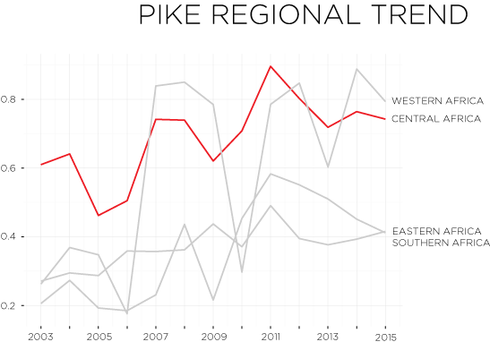
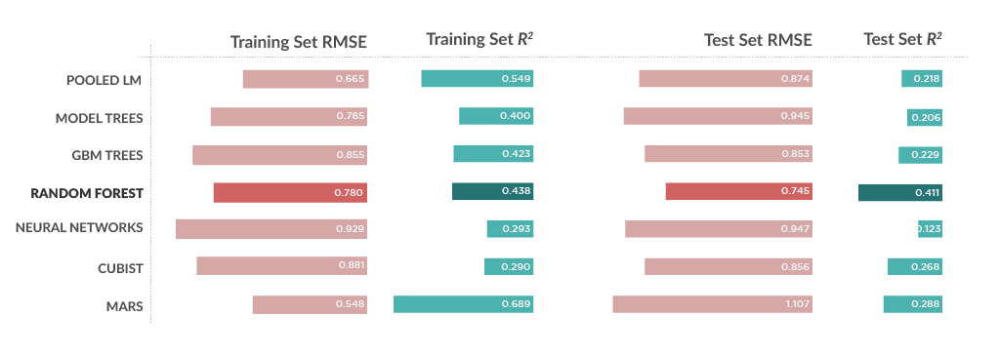

```{r setup, include=FALSE}
library(ggplot2)
library(ggthemes)
library(psych)
library(GGally)
library(grDevices)
library(colorRamps)
library(dplyr)
library(maptools)
library(RColorBrewer)
library(blme)
library(lubridate)
library(reporttools)
library(stargazer)
library(fpp)
library(xtable)
library(plotly)
library(Cairo)
library(MASS)
library(car)
library(Amelia)
library(corrplot)
library(caret)
library(plm)
library(xtable)
library(formattable)
library(partykit)
library(Rgraphviz)
library(RWeka)
library(rJava)
library(gbm)
library(earth)
library(doMC)
library(randomForest)
library(Cubist)
library(nnet)

# READ IN DATA
elephants <- read.csv("elephant_master_reduced.csv", header = TRUE)

# CREATE VARIABLES TO ASSESS LEVEL OF ILLEGAL KILLING OF ELEPHANTS
elephants$High.Illegal <- factor(with(elephants, 
                                      ifelse((Percent.Illegal > 0.5), 1, 0)))

# SEPARATE DATA INTO REGIONS AND PLOT GOVERNANCE INDICATORS
elephantsFC <- filter(elephants, subregionid=="FC")
elephantsFW <- filter(elephants, subregionid=="FW")
elephantsFE <- filter(elephants, subregionid=="FE")
elephantsFS <- filter(elephants, subregionid=="FS")


```

## Introduction

In the summer of 2012, more than 100 maurauders on horseback crossed from Chad into Cameroon's Bouba Ndjidah National park with one mission: to kill as many elephants as possible without getting caught. Using rocket-propelled grenades and AK-47s, they mowed down hundreds of elephants, decimating entire herds, all for one reason: ivory.  

The illegal killing of elephants in Africa for their ivory takes places sometimes on a small scale, with poisoned watermelons, and other times on a large scale, using belt-fed automatic weapons. But regardless of the method, when an elephant comes into contact with a poacher, more often than not, the poacher gets what he came for. This is why between 2010 and 2012 alone, some 100,000 elephants were slaughtered. Their only "crime" that they hold the ivory that the world cannot seem to resist.  

### 1. Background  
In 1979, some 1.3 million elephants roamed wild in the countries of Sub-Saharan Africa; a decade later, fewer than half that number remained. So in 1989, the Convention on Trade in Endangered Species of Wild Fauna and Flora (CITES) moved the elephant to its most restrictive Appendix and banned the international trade in ivory. Since then, CITES has allowed two large sales of stockpiled ivory, once in 1999 and again in 2008.  

The sale in 1999 allowed three African nations—Zimbabwe, Botswana, and Namibia—to sell a portion of their stockpiles to Japan. At the time, however, no reliable ways of tracking the impact of poaching on illegal trade existed.  

The second sale, in 2008, allowed the three countries from the 1999 sale, along with South Africa, to sell more than 100 tons of stockpiled ivory to Japan and China. By then, CITES had established a program to monitor illegal killing, so the impact of the sale on poaching could be evaluated.  

From the start, however, the 2008 sale was problematic. In short, it was rigged. Japanese and Chinese buyers colluded to keep prices low, with each only bidding on certain types of ivory, e.g., full tusks vs. pieces. Thus, the invory fetched an average of just USD 67 per pound. But the Chince government then resold the ivory to its buyers for upwards of USD 500 per pound. Because of this, the price of ivory exploded and poaching became a much more lucrative activity.

The sale proved catastrophic for African elephant populations (Hsiang & Sekar, 2016). According to a report by the National Geographic Society, "the future of the African elephant may forever be clouded by the moment when CITES, lacking the data to evaluate the impact of its first ivory sale, endorsed a second" (Christy, 2012). Indeed, following the 2008 sale, the production of illegal ivory through poaching increased by 66% and ivory seizures from Africa increased by about 71% (Kelly, 2016). Current estimates of illegal killing are between 30,000 and 40,000 per year, or about one every 15 minutes.

### 2. Methods and Data

This project seeks to understand the socio-economic factors that may contribute to poaching. It is crucial for us to understand these contributing factors so that they may be remedied, thus allowing for the continuation of elephants in the wild. For it has been estimated that, at the current rate of killing, all elephants in the wild will be gone within 10 years.  

Several researchers have studied the problem, and their findings will be taken into account in the model. For instance, Lemieux and Clark (2009) studied the effect of regulated and unregulated markets and showed that the presence of unregulated markets, either in-country or in a bordering country, had a significant impact on poaching activity.

The initial dataset included socio-economic and governance data on 34 countries with elephant populations in Central, Western, Eastern, and Southern Africa. These data came from the International Monetary Fund (IMF), the UN Development Programme (UNDP), the Unesco Institute for Statistics, The World Bank, and Transparency International (see the codebook for specifics). Information regarding regulated and unregulated ivory markets in Africa came from Lemieux and Clark (2009), and conflict data came from the Uppsala Conflict Data Programme (UCDP). Data concerning elephant populations and poaching came from the Monitoring the Illegal Killing of Elephants (MIKE) program of CITES. 

The inital dataset contained 50 variables and 476 observations. Due to missing values in the dependent variable, the number of observations was reduced to 301 total observations. Moreover, a correlation plot was created (Figure 2.1) and revealed a number of variables correlated at a threshold above 0.8. Linear regression was performed on correlated pairs to determine which had a greater impact on the dependent variable. A total of 16 variables were removed, leaving a total of 33.

Together, these data will allow a comprehensive assessment of one side of the poaching equation, namely, conditions in Africa that may contribute to illegal elephant killing. What these data do not address is the demand side of the equation. That is, we do not have the benefit of trafficking and sales data whereby illegal ivory is transmitted and sold to consumers, largely in Asian and Southeast Asian countries. Unfortunately such data is not readily accessible and gathering such data would be beyond the scope of this project.

The data were divided into training and test sets prior to imputation of missing values. Due to the limited number of observations relative to the number of variables, it was necessary to create a 60:40 split. Higher ratios of training set size to test set size were attempted, but imputation failed in those cases.

#### Figure 2.1.1: Correlation plot of variables
```{r echo=FALSE, fig.align="center"}
centered.elephants <- data.frame(scale(elephants[,c(9:28,33:38,41:47)]))
centered.elephants <- cbind(elephants[,c(1:8, 29:32,39:40, 48)],
                            centered.elephants)
centered.elephants$High.Illegal <- as.integer(centered.elephants$High.Illegal)

clrs <- brewer.pal(10, "Spectral")
cors <- cor(centered.elephants[,9:48], use = "pairwise")
corr.plot <- corrplot.mixed(cors, col = clrs, number.cex=0.3,
                     tl.pos="lt", tl.cex=0.5, tl.col="black",
                     tl.srt=45)

# SELECT THOSE VARIABLES THAT SHOULD REMAIN
pd.elephants <- subset(centered.elephants, subset=TRUE,
                       select=c(1:22,24:28,30:34,36:48))

# SEPARATE DATA INTO TRAINING AND TESTING SETS
inVal <- createDataPartition(pd.elephants$High.Illegal, p = 0.6, list=FALSE)
eleph.train <- pd.elephants[inVal,]
eleph.test <- pd.elephants[-inVal,]

```


## 3. Exploratory data analysis
Exploratory data analysis revealed several compelling statistics. Namely, when data were separated according to geographical region and governance indicators were assessed, Central Africa showed considerable volatility (Figure 3.1, 3.2). This corresponds with PIKE scores for the regions, which also shows consistently high levels of illegal poaching (Figure 3.3). 

What's more, when we examine mean scores for PIKE and several governance indicators, we see that Central Africa data show substantial problems for the region. The mean PIKE score, which represents the proportion of illegally killed elephants, for Central Africa is `r round(mean(elephantsFC$PIKE.regional, na.rm = TRUE), digits = 2)`, substantially higher than any other region. And, for instance, the mean corruption control assessment for each region reveals Central Africa, at `r round(mean(elephantsFC$Corruption.Control, na.rm = TRUE), digits = 2)`, to be substantially lower than Western, Southern, or Easterm Africa, which are `r round(mean(elephantsFW$Corruption.Control, na.rm = TRUE), digits = 2)`, `r round(mean(elephantsFS$Corruption.Control, na.rm = TRUE), digits = 2)`, `r round(mean(elephantsFE$Corruption.Control, na.rm = TRUE), digits = 2)`, respectively.


#### Figure 3.1.1: Governance indicators for Central Africa
```{r echo=FALSE, fig.align="center"}
governanceFC <- ggplot(data=elephantsFC, aes(x=year))+
  geom_line(aes(y=Voice.Accountability), color="cadetblue3")+
  geom_line(aes(y=Political.Stability), color="coral")+
  geom_line(aes(y=Government.Effectiveness), color="aquamarine")+
  geom_line(aes(y=Rule.Law), color="gold")+
  geom_line(aes(y=Corruption.Control), color="palegreen")+
  geom_line(aes(y=Reg.Quality), color="darkorchid1")+
  ylim(-2, 0.5) + xlab(NULL) + ylab(NULL) +
  ggtitle("Governance indicators for Central Africa") + theme_bw()
governanceFC + facet_wrap(~country, ncol = 3)
```


#### Figure 3.1.2: PIKE scores by region


## 4. Data modeling and results
```{r include=FALSE, cache=TRUE}
# IMPUTE MISSING VALUES WITH A SINGLE IMPUTATION
library(snow)
set.seed(1357)
elephants.out.train <- amelia(eleph.train, m=1, frontend = FALSE, 
                              idvars = c("ISO2", "ISO3", "region", 
                                         "subregionid", "cap.lat", "cap.long"),
                              ts = "year", cs = "country", 
                              polytime = 0, intercs = TRUE, p2s = 1, 
                              parallel="snow", ncpus = 3, 
                             empri = .01*nrow(centered.elephants))

elephants.out.test <- amelia(eleph.test, m=1, frontend = FALSE, 
                                                idvars = c("ISO2", "ISO3",
                                                           "region", 
                                                           "subregionid",
                                                           "cap.lat", "cap.long"),
                                                ts = "year", cs = "country", 
                                                polytime = 0, intercs = TRUE, 
                                                p2s = 1, 
                                                parallel="snow", ncpus = 3, 
                                                empri =
                                                .15*nrow(centered.elephants))

# CREATE AND SUBSET DATASET FROM AMELIA OUTPUT
write.amelia(obj=elephants.out.train, file.stem = "outTrain")
outTrain <- read.csv("outTrain1.csv", header = TRUE)

write.amelia(obj=elephants.out.test, file.stem = "outTest")
outTest <- read.csv("outTest1.csv", header = TRUE)

outTrainSub <- subset(outTrain, subset=TRUE, select=c(10:15,17:35,37:40,42:43,46))

outTestSub <- subset(outTest, subset=TRUE, select=c(10:15,17:35,37:40,42:43,46))
```
Multiple models were run in this analysis of the data, including pooled linear regression, model trees, gradient boosted machines (GBM), random forest, cubist, neural networks, and multivariate adaptive regression splines (MARS). Each of the aforementioned models have unique advantages, so it was thought that by running a number of them, a stable, robust result could be gleaned from the dataset. 

#### 4.1 Pooled Linear Regression  
Multiple regression using a pooled linear model from the `plm` package was run with `country` and `year` as index variables. Feature slection followed a forward selection procdure with \alpha = 0.10. The final model uses three variables that met the criteria. The variable `corruption control` had the lowest *p*-value, leading to an initial assumption that public corruption heavily influences the illegal killing of elephants. It should be noted that PLM was the only model to incorporate the longitudinal variables.

The model applied to the training set achieved an RMSE of 0.665. However, when applied to the test set RMSE rose to 0.874, with an $R^2$ of just 0.218.

```{r warning=FALSE, cache=TRUE}
# RUN POOLED LINEAR REGRESSION 
eleph.train.plm <- plm(Percent.Illegal ~ Corruption.Control +
                                       PCPI + GGXWDG_NGDP,
                                     index=c("country", "year"), 
                                    model = "between",
                                     data = outTrain)
                               
rmsePLM <- sqrt(1-(0.54929 * sd(outTrain$Percent.Illegal)))
predPLM <- predict(eleph.train.plm, newdata = outTest)
measurePLM <- postResample(predPLM, outTest$Percent.Illegal)
summary(eleph.train.plm)
measurePLM
```

#### 4.2 Model trees  
Both the standard and rules-based models were run on the dataset. The standard model tree performed better, with a slightly lower RMSE than the rules-based model tree, so it was the one incorporated here. The model tree fitted to the training set achieved an $R^2$ of 0.400 and an RMSE of 0.7853, but $R^2$ fell to 0.206 when run on the test set and RMSE rose to 0.945.  
```{r warning=FALSE, cache=TRUE}
# RUN MODEL TREE ALGORITHM

registerDoMC(cores = 3)
m5train <- M5P(Percent.Illegal ~ ., data = outTrainSub)

set.seed(100)
measure1M5 <- postResample(m5train$predictions, outTrainSub$Percent.Illegal)
predM5 <- predict(m5train, newdata = outTestSub)
measureM5 <- postResample(predM5, outTestSub$Percent.Illegal)
summary(m5train)
measureM5
```

#### 4.3 GBM Trees
Gradient boosted machine models were run on the data, starting with 100 trees, and ultimately using 1000 trees. The model fitted to the training set achieved an $R^2$ of 0.423 and a cross-validated RMSE of 0.855. But $R^2$ fell to 0.229 when the model was applied to the test set, though RMSE held at 0.853.
```{r warning=FALSE, cache=TRUE}
# RUN GBM TREE MODEL
set.seed(100)
modelGBM <- gbm(Percent.Illegal ~ ., data = outTrainSub,
                distribution = "gaussian",
                n.trees = 1000,
                n.minobsinnode = 2,
                cv.folds = 10,
                shrinkage = 0.001)
modelGBM
summary(modelGBM)
measure1GBM <- postResample(modelGBM$fit, outTrainSub$Percent.Illegal)
predGBM <- predict.gbm(modelGBM, newdata = outTestSub,
                       n.trees = 1000)
measureGBM <- postResample(predGBM, outTestSub$Percent.Illegal)
```

#### 4.4 Random Forest
Of all the models run, random forest performed the best and was the most consistent between the training and test sets, with only a minor drop in $R^2$ and small rise in cross-validated RMSE from one to the next. The model achieved an $R^2$ of 0.438 when fitted to the training set and an RMSE of 0.780. When the model was fitted to the test set, $R^2$ held at 0.411 on the test set, and the cross-validated RMSE was 0.732.
```{r warning=FALSE, cache=TRUE}
# RUN RANDOM FOREST MODEL
set.seed(100)
fitControl <- trainControl(method = "cv", number = 10,
                           returnData = TRUE,
                           savePredictions = TRUE)

modelRF <- train(Percent.Illegal ~ ., data=outTrainSub,
                 method = "rf",
                 trControl=fitControl,
                 ntrees=1000,
                 allowParallel=TRUE,
                 prox=TRUE,
                 importance=TRUE)

predRF <- predict(modelRF, newdata = outTestSub)
measureRF <- postResample(predRF, outTestSub$Percent.Illegal)
modelRF
plot(varImp(modelRF))
```

#### 4.5 Neural Networks  
Neural network models with various tuning parameters were run. The final model used size = 1 and decay = 0.01. $R^2$ for this model was quite low, at 0.293, and RMSE was 0.929. However, $R^2$ fell to 0.123, with RMSE at 0.947, when applied to the test set. Corruption control and regulatory quality with the first and second most important variables influencing the model.  
```{r warning=FALSE, cache=TRUE}

# RUN NEURAL NETWORK MODEL
nnetGrid <- expand.grid(.decay = c(0, 0.01, 0.1),
                        .size = c(1:10),
                        .bag = FALSE)
set.seed(100)
modelNN <- train(Percent.Illegal ~ ., data = outTrainSub,
                 method = "avNNet",
                 tuneGrid = nnetGrid,
                 trControl = fitControl,
                 lineout = TRUE,
                 trace = FALSE,
                 MaxNWts = 10 + (ncol(outTrainSub) + 1) + 10 + 1,
                 maxit = 500,
                 importance=TRUE)

predNN <- predict(modelNN, newdata = outTestSub)
measureNN <- postResample(predNN, outTestSub$Percent.Illegal)
modelNN
plot(varImp(modelNN))
```

#### 4.6 Cubist
The cubist model had an $R^2$ of 0.368 and a cross-validated RMSE of 0.814 when fitted to the training set. But $R^2$ fell to 0.268 when applied to the test set and its RMSE rose to 0.856. As with several other models, corruption control stood out as the variable of most importance.
```{r warning=FALSE, cache=TRUE}

# RUN CUBIST MODEL

modelCubist <- train(Percent.Illegal ~ ., data = outTrainSub,
                     method = "cubist",
                     trControl = fitControl,
                     importance = TRUE)

predCubist <- predict(modelCubist, newdata = outTestSub)
measureCubist <- postResample(predCubist, outTestSub$Percent.Illegal)
modelCubist
plot(varImp(modelCubist))
```

#### 4.7 Multivariate Additive Regression Splines
The MARS model performed quite well when fitted to the training set. It had an $R^2$ of 0.689 and a GCV of 0.519, which equaled an RMSE of 0.548. However, the performance of the model fell precipitously when applied to the test set, with an $R^2$ of 0.288 and an RMSE of 1.107.
```{r warning=FALSE, cache=TRUE}

# RUN MARS MODEL
set.seed(100)
earthMars <- earth(Percent.Illegal ~ ., data = outTrainSub)

MarsRMSE <- sqrt(1 - (0.6888798 * sd(outTrainSub$Percent.Illegal)))
predMars <- predict(earthMars, newdata = outTestSub)
measureMars <- postResample(predMars, outTestSub$Percent.Illegal)
earthMars
evimp(earthMars)
```


## Conclusions
Due to the limitations of the analysis, it is perhaps not surprising that none of the models performed exceedingly well (Figure 5.1.1). Nonetheless, some important implications can be gleaned. The MARS model performed better when fitted to the training set than other models. Performance fell significantly, however, when the model was applied to the test set, suggesting that the model overfit the data. Likewise, other models that performed somewhat well also performed much better when fitted to the training data than they did when predicted against the training data. Yet while the random forest model had higher initial RMSE than the MARS model, it appeared to be a better fit, with only a moderate rise in RMSE when the fitted model was applied to the test set. Indeed, further analysis using Spearman's rank correlation reveals that the random forest model, with a correlation of 0.614, outperforms the MARS model, which has a correlation of 0.564.

The variables that appeared at or near to top in importance across the various models were corruption control, regulatory quality (an indication of support for the private sector from government), and PCPI (the level of consumer inflation). Other indicators, such as the indicators of high levels of poverty and lack of education or opportunities for education, also ranked high. And as expected, the presence of an unregulated ivory market in bordering countries also influenced the models. Taken together, these indicators suggest that efforts to control corruption and reduce poverty through, for example, education initiatives, could have an impact on the illegal poaching of elephants.

We saw in the exploratory analysis of the data that Central Africa appeared to show more volatility than other regions in terms of issues of governance. And we can see from Figure 5.1.2 that the region has the highest mean percentage of elephants killed illegally. If we look at just the top three indicators influencing poaching, we see that the countries of Central Africa seem to struggle in these areas more than other regions (Figures 5.1.3 — 5.1.5). Efforts to combat corruption, poverty, and lack of opportunity should, therefore, begin there.

Finally, it is important to acknowledge again the limitations of this analysis. The poaching crisis for the African elephant does not happen in a vacuum. Its purpose is transactional, with the buyers of ivory also having an influence. Most of the ill-gotten ivory ends up in the countries of Asia. And while China is now taking steps to close down its ivory markets, other countries, specifically those of Southeast Asia, show no slowdown in activity. So while efforts on the African supply side may slow the slaughter, until the purchase and possession of ivory becomes sweepingly anastigmatic, the African elephant will be in peril.  

```{r}
# CREATE TABLE OF RESULTS
ModelName <- c("Pooled LM", "Model Tree", "GBM", "Random Forest",
               "Neural Networks", "Cubist", "MARS")
ModelRMSE <- c(0.665, 0.785, 0.855, 0.780, 0.929, 0.881, 0.548)
ModelRSq <- c(0.549, 0.400, 0.423, 0.438, 0.293, 0.290, 0.689)
TestRMSE <- c(0.874, 0.945, 0.853, 0.745, 0.947, 0.856, 1.107)
TestRSq <- c(0.218, 0.206, 0.229, 0.411, 0.123, 0.268, 0.288)
Results <- cbind(ModelName, ModelRMSE, ModelRSq, TestRMSE, TestRSq)

```
#### 5.1.1 Table of results from each model


#### 5.1.2 Percentage of elephants dying due to poaching  
```{r echo=FALSE, warning=FALSE, fig.align="center"}
means <- read.csv("eleph_mean.csv", header = TRUE)
mcols <- brewer.pal(4, "Spectral")
illegal <- ggplot(means, aes(x=Country, y=Illegal, color=Country))+
  geom_point(size=4) +
  ylim(-1, 1) +
  labs(y=NULL, x=NULL)
illegal <- illegal + theme_bw()
illegal
```  
  
#### 5.1.3 Control of public corruption  
```{r echo=FALSE, fig.align="center"}
corrupt <- ggplot(means, aes(x=Country, y=Corruption.Control, color=Country))+
  geom_point(size=4) +
  ylim(-1, 1) +
  labs(y=NULL, x=NULL)
corrupt <- corrupt + theme_bw()
corrupt
```  
  
#### 5.1.4 Support for private sector development from government  
```{r echo=FALSE, fig.align="center"}
regq <- ggplot(means, aes(x=Country, y=Reg.Quality, color=Country))+
  geom_point(size=4) +
  ylim(-1, 1) +
  labs(y=NULL, x=NULL)
regq <- regq + theme_bw()
regq
```  
  
#### 5.1.5 Consumer inflation  
```{r echo=FALSE, fig.align="center"}
inflat <- ggplot(means, aes(x=Country, y=PCPI, color=Country))+
  geom_point(size=4) +
  ylim(-1, 1) +
  labs(y=NULL, x=NULL)
inflat <- inflat + theme_bw()
inflat
```

### References
  
Christy, B. (2012). Blood Ivory: Ivory Worship. *National Geographic*. Retrieved from [http://ngm.nationalgeographic.com/2012/10/ivory/christy-text](http://ngm.nationalgeographic.com/2012/10/ivory/christy-text)

Hsiang, S., and Sekar, N. (2016). Does Legalization Reduce Black Market Activity? Evidence from a Global Ivory Experiment and Elephant Poaching Data. *National Bureau of Economic Research*. Retrieved from [http://www.nber.org/papers/w22314](http://www.nber.org/papers/w22314)

Kelly, M. (2016). After legal-ivory experiment, black markets thrive from greater demand, less risk. Princeton University. Retrieved from [http://www.princeton.edu/main/news/archive/S46/59/11K97/?section=topstories](http://www.princeton.edu/main/news/archive/S46/59/11K97/?section=topstories)
  
Lemeiux, A. M., and Clarke, R. V. (2009). The International Ban on ivory sales and its effects on elephant poaching in Africa. *British Journal of Criminology*, 49, 451-471.

